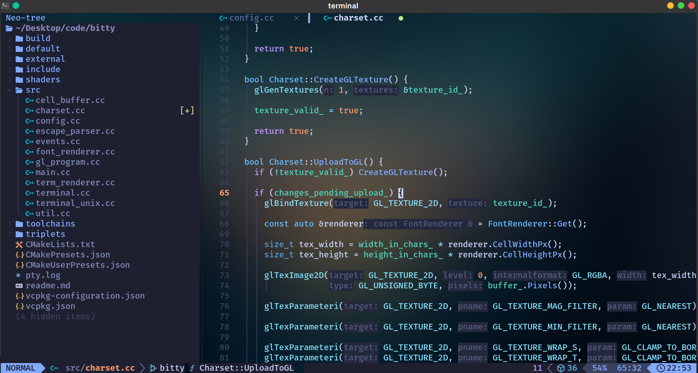

# Bitty 📟

A WIP OpenGL terminal emulator written in modern C++, focusing on performance and simplicity.
It mainly depends on GLFW, GLM, Nlohmann JSON, Freetype, Fontconfig, and some Boost libraries.

**Currently only supports Linux!**

Here's what it looks like on my machine right now, running neovim:


With a few minor visual artifacts and bugs here and there and a lack of support for emojis or resizing the window, it's currently at a stage where it's generally functional for most use cases but not necessarily usable as a daily driver.

I implement ANSI escape codes as I need them. Around 33 parsing rules have been implemented to that end, powered by a DFA for convenience.

**List of things I have run with it:**
- `zsh` with a Powerlevel10k prompt
- `nano`
- `vim`
- `neovim`
- `fastfetch`
- `tmux`
- `man`

# Build
1. Make sure you have `vcpkg` installed.
2. Proceed to build using CMake.

The project is using a clang-based toolchain by default.
You may opt out of this and use your compiler of choice by editing `CMakePresets.json` and removing the relevant definitions.

# Configuration
Searches for a config in `~/.bitty.json`.

Example configuration:

```json
{
  "font_family": "Fira Code Nerd Font",
  "font_size": 13.0,
  "opacity": 0.6
}
```
There's not a lot of options as the emulator itself isn't very feature-rich as of now.